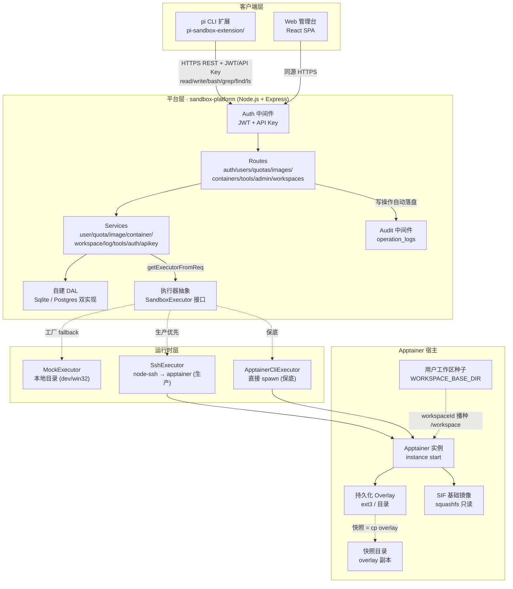
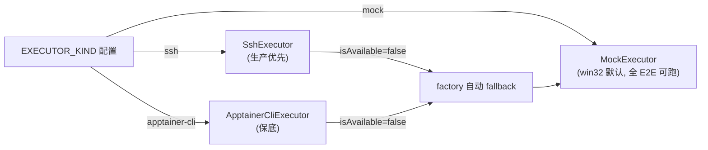
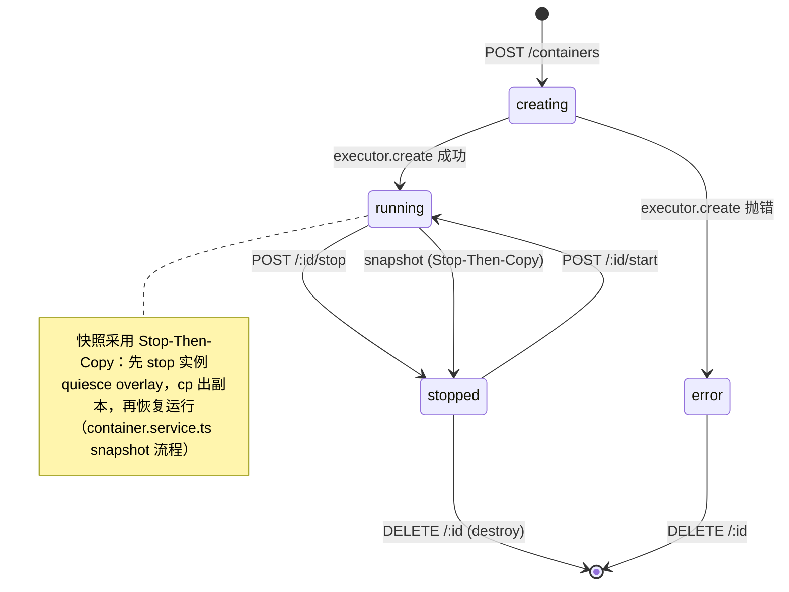
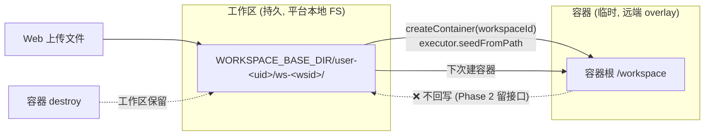

# AgentSandbox 项目架构图

> 初版源：企业产品评估报告（2026-08-07）。随实现演进持续更新；当前态以本图 + `AGENTS.md` 为准。

## 整体架构（Mermaid）



**图例**：快照（Stop-Then-Copy）与工作区种子均已实现（见 `container.service.ts` / `workspace.service.ts`）。

## 核心数据流

```
pi 扩展(本地)  ──HTTPS REST + JWT/API-key──►  平台(Express)  ──SSH / apptainer CLI──►  Apptainer 容器
read/write/bash/grep/find/ls                 控制平面 + 执行器         实例 + 持久化覆盖层
                       ◄──SSE 流(bash)──
Web 管理台(浏览器) ──同源 HTTPS──► 平台(同上)
```

## 分层职责

| 层 | 职责 | 关键文件 |
|---|---|---|
| 客户端 | pi 工具覆盖 + 斜杠命令；React 管理台 | `pi-sandbox-extension/`, `sandbox-platform/web/` |
| 路由 | 参数校验（zod）+ 鉴权 + 调 service + 返回 JSON | `src/routes/*.routes.ts` |
| 服务 | 业务逻辑，工厂函数 `createXxxService(db)` | `src/services/*.service.ts` |
| 执行器抽象 | 平台 ↔ 容器运行时边界，三实现 + 工厂 fallback | `src/executors/types.ts` + 三实现 |
| DAL | 屏蔽 sqlite/pg 方言差异，`?` 占位符统一 | `src/db/driver.ts` |
| 宿主 | Apptainer 实例 + overlay + 快照 + 工作区种子 | 远端文件系统 |

## 执行器选择策略



## 容器生命周期状态



## 用户工作区数据流（本轮新增）


